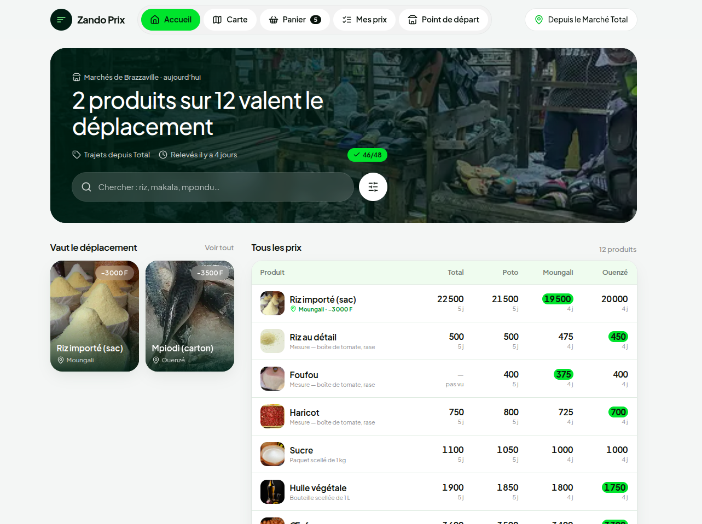
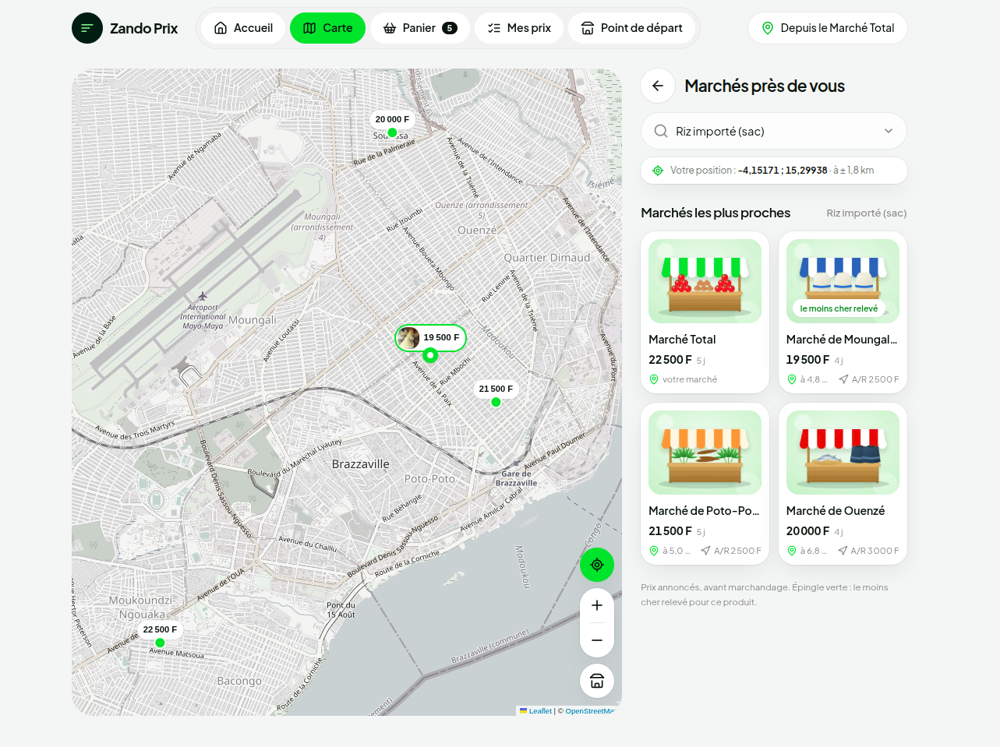
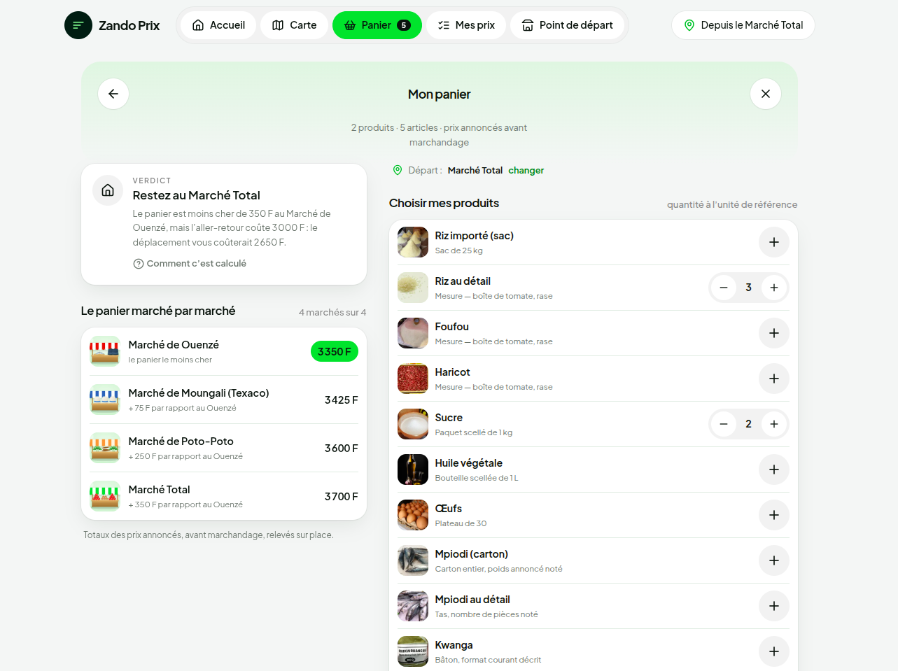
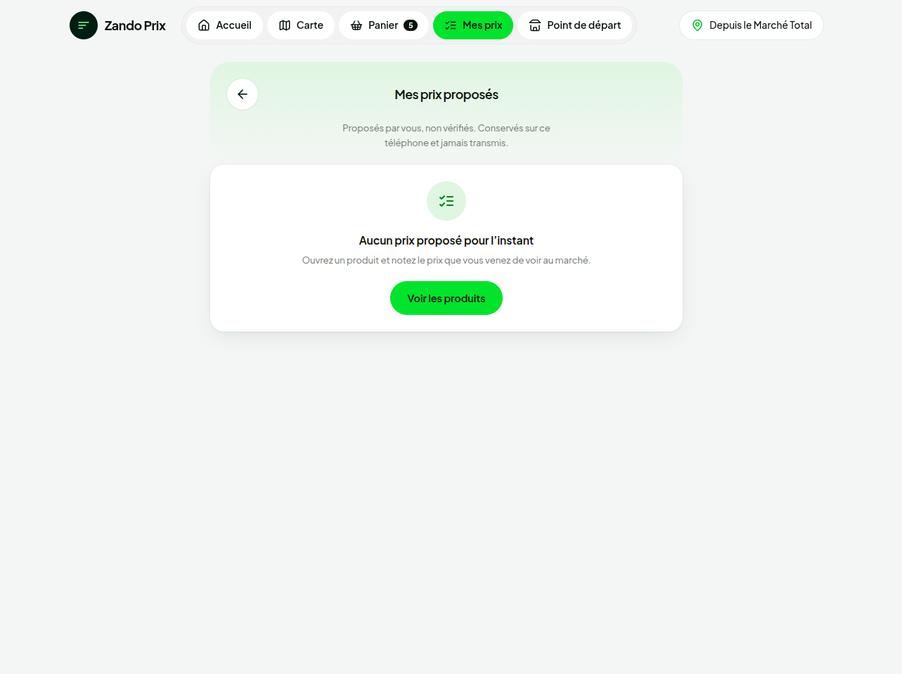

<div align="center">

# Zando Prix

### Le bon prix, au bon marché — et seulement si le taxi en vaut la peine.

**Comparez en un coup d'œil les prix annoncés sur quatre grands marchés de Brazzaville,
et sachez tout de suite si traverser la ville vous fait vraiment économiser.**

Marché Total · Poto-Poto · Moungali · Ouenzé

`PWA installable` · `Fonctionne hors ligne` · `< 300 Ko au premier écran` · `Aucun compte` · `Aucune donnée envoyée`



</div>

---

## Pourquoi Zando Prix ?

Riz, foufou, mpiodi, kwanga, makala… Le même sac de riz peut coûter **3 000 F de moins**
à l'autre bout de la ville. Mais l'aller-retour en taxi coûte lui aussi 2 000 à 3 000 F.
Alors, est-ce que ça vaut le coup ?

**Zando Prix fait le calcul à votre place.** Ce n'est pas une simple liste de prix : l'application
retire le prix du taxi depuis *votre* marché et vous donne une réponse claire,
**« ça vaut le déplacement »** ou **« restez où vous êtes »**.

- **12 produits du quotidien** comparés sur **4 marchés**, avec le mot qu'emploie vraiment la vendeuse.
- **Un verdict honnête** : l'écart de prix est comparé au vrai coût de l'aller-retour.
- **Tout le panier d'un coup** : vos courses de la semaine, chiffrées marché par marché.
- **Des prix datés** : chaque relevé affiche son âge. Un prix trop vieux est mis de côté, jamais affiché comme s'il était neuf.
- **Pensé pour Brazzaville** : léger, installable sur l'écran d'accueil, utilisable sans réseau.
- **Respect de la vie privée** : pas de compte, pas de pistage, votre position ne quitte jamais le téléphone.

---

## Visite guidée

### L'accueil : la réponse dès le premier coup d'œil

Le titre dit tout de suite combien de produits valent le déplacement depuis votre marché.
Le tableau compare les 12 produits sur les 4 marchés. Le moins cher est surligné en vert et
chaque prix indique son âge (« 4 j »). La recherche reconnaît aussi les noms locaux :
*loso*, *makala*, *mpondu*…

### La carte : vos marchés, vos prix, votre position



Choisissez un produit : chaque marché affiche son prix directement sur la carte.
L'épingle verte marque le moins cher relevé. À côté, les fiches indiquent la distance
et le prix de l'aller-retour en taxi.

### Le panier : vos courses, chiffrées marché par marché



Ajoutez vos produits et leurs quantités. Zando Prix additionne tout, classe les marchés
du moins cher au plus cher, puis **retire le prix du taxi** pour donner son verdict.
Ici : le panier coûte 350 F de moins à Ouenzé, mais le taxi coûte 3 000 F. **Restez au Marché Total.**

### Le point de départ : la réponse change selon d'où vous partez


Pour les mêmes prix, la réponse n'est pas la même selon votre quartier. Choisissez votre
marché à la main, ou laissez l'application trouver le plus proche. La position n'est
demandée que si vous appuyez sur le bouton, jamais au chargement.

### Mes prix : vous avez vu un prix ? Notez-le



Vous êtes au marché et le prix a changé ? Proposez-le en deux gestes, sans compte.
Votre contribution reste sur votre téléphone : elle ne se mélange jamais aux relevés officiels.

---

> ⚠ Les 48 prix du fichier de données sont **provisoires** : plausibles mais inventés,
> en attente des relevés terrain. Voir `../DEMANDES-AU-PM.md`.

## Comment l'application décide

- **Fraîcheur** : un prix de moins de 7 jours est vert, de 7 à 14 jours il est orange
  « à vérifier », au-delà il est périmé et retiré des comparaisons.
- **Vaut le déplacement** : l'écart de prix doit dépasser le prix de l'aller-retour en taxi
  depuis votre point de départ (2 000 F par défaut). Il faut au moins 3 marchés sur 4 avec un prix récent.
- **Badge « le moins cher relevé »** : il faut au moins 2 marchés récents et un prix strictement
  plus bas que les autres.
- **Panier** : seuls les marchés qui ont un prix utilisable pour tous les produits du panier sont classés.

Toutes ces règles sont dans `js/regles.js` et `js/panier.js`, et couvertes par les tests.

## Démarrage rapide

Prérequis : **Node.js 22+**.

```bash
npm install
npm run build      # données, validation, tests, CSS, publication dans public/
npm start          # http://localhost:8000
```

C'est un site statique : aucun serveur applicatif, aucune base de données.
Sur **Vercel**, `npm run build` produit le dossier `public/`, qui est servi tel quel.

## Mettre à jour les prix

Tout se passe dans `outils/generer-donnees.js` :

1. Saisir les prix relevés dans `PRODUITS` et les prix du taxi dans `TRAJETS`.
2. Mettre à jour `DATES_RELEVES` avec les dates du passage sur le terrain. Ces dates sont fixes :
   un nouveau déploiement ne les rajeunit pas.
3. Lancer `npm run build`. Le validateur bloque le déploiement si les données contiennent une erreur.

Pour voir l'application à une autre date sans toucher aux données : `http://localhost:8000/?date=+9`.

## Vie privée

Pas de compte, pas de pistage. La position de l'appareil sert à un calcul local et n'est jamais
envoyée. Les prix proposés restent sur le téléphone.

## Limites actuelles

- Les prix sont **provisoires**, en attente des relevés terrain.
- La position du « Marché de Ouenzé » (Marché Soukissa sur OpenStreetMap) reste à confirmer.
- La carte utilise les serveurs OpenStreetMap, ce qui convient à un prototype mais pas à la production.
  Elle n'est pas disponible hors ligne.

## Crédits

Photos CC0 / domaine public · Police Plus Jakarta Sans (OFL) · Leaflet (BSD) · Tailwind CSS (MIT) ·
Icônes Lucide (ISC) · Fonds de carte © contributeurs OpenStreetMap (ODbL).
